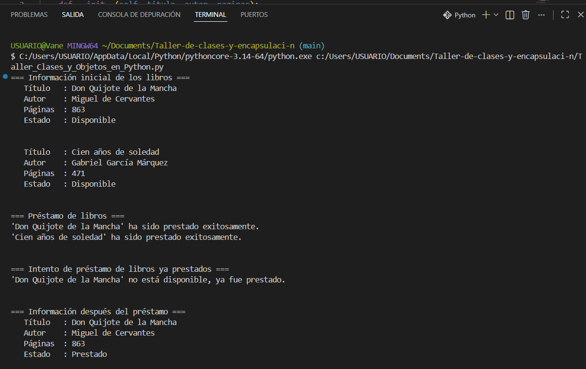
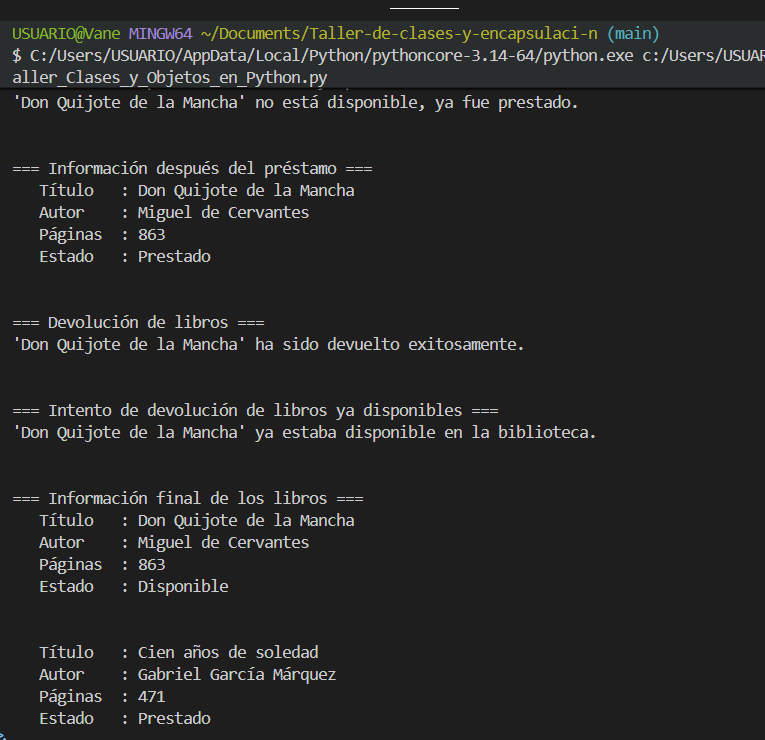
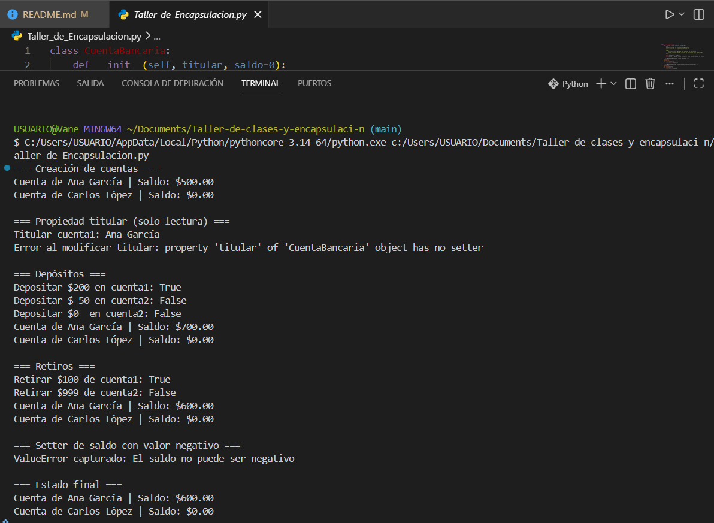

# 🐍 Taller de Programación Orientada a Objetos en Python

Ejercicios prácticos sobre **Clases, Objetos y Encapsulación** en Python.

---

## 📁 Estructura del proyecto

```
Taller_de_clases y encapsulaci-n/
├── Taller_Clases_y_Objetos_en_Python.py     # Taller 1 – Clases y Objetos
├── Taller_de_Encapsulacion.py               # Taller 2 – Encapsulación
└── README.md
```

---

## 📖 Taller 1 – Clases y Objetos: `Taller_Clases_y_Objetos_en_Python`

### Descripción

Implementación de una clase `Libro` que representa un libro en una biblioteca, con gestión de préstamos y devoluciones.

### Atributos

| Atributo      | Tipo    | Descripción                                      |
|---------------|---------|--------------------------------------------------|
| `titulo`      | `str`   | Título del libro                                 |
| `autor`       | `str`   | Autor del libro                                  |
| `paginas`     | `int`   | Número total de páginas                          |
| `disponible`  | `bool`  | Estado de disponibilidad (inicialmente `True`)   |

### Métodos

| Método          | Retorno | Descripción                                                                 |
|-----------------|---------|-----------------------------------------------------------------------------|
| `__init__()`    | —       | Inicializa los atributos del libro                                          |
| `prestar()`     | `str`   | Cambia disponibilidad a `False`. Avisa si ya estaba prestado               |
| `devolver()`    | `str`   | Cambia disponibilidad a `True`. Avisa si ya estaba disponible              |
| `informacion()` | `str`   | Retorna una cadena con todos los datos del libro y su estado actual        |

### Ejemplo de uso

```python
libro = Libro("Don Quijote de la Mancha", "Miguel de Cervantes", 863)

print(libro.informacion())  # Estado: Disponible
print(libro.prestar())      # ✅ Libro prestado
print(libro.prestar())      # ❌ Ya está prestado
print(libro.devolver())     # ✅ Libro devuelto
print(libro.devolver())     # ⚠️ Ya estaba disponible
```

### Salida esperada

```
=== Información inicial de los libros ===
📖 Título   : Don Quijote de la Mancha
   Autor    : Miguel de Cervantes
   Páginas  : 863
   Estado   : Disponible

=== Préstamo de libros ===
✅ 'Don Quijote de la Mancha' ha sido prestado exitosamente.

=== Intento de préstamo de libros ya prestados ===
❌ 'Don Quijote de la Mancha' no está disponible, ya fue prestado.
```
Evidencia:  y 
---

## 🏦 Taller 2 – Encapsulación: `Taller_de_Encapsulacion`

### Descripción

Implementación de una clase `CuentaBancaria` que aplica el principio de **encapsulación** mediante atributos privados y propiedades de Python (`@property`).

### Atributos privados

| Atributo    | Tipo    | Descripción                        |
|-------------|---------|------------------------------------|
| `_titular`  | `str`   | Nombre del titular de la cuenta    |
| `_saldo`    | `float` | Saldo actual de la cuenta          |

### Propiedades

| Propiedad  | Acceso          | Descripción                                                                 |
|------------|-----------------|-----------------------------------------------------------------------------|
| `titular`  | Solo lectura    | Retorna el nombre del titular. No permite modificación                      |
| `saldo`    | Lectura/escritura | Retorna el saldo. El setter lanza `ValueError` si el valor es negativo    |

### Métodos

| Método               | Retorno | Descripción                                                              |
|----------------------|---------|--------------------------------------------------------------------------|
| `__init__()`         | —       | Inicializa titular y saldo (por defecto `0`)                             |
| `depositar(cantidad)`| `bool`  | Suma al saldo si `cantidad > 0`. Retorna `True` si fue exitoso           |
| `retirar(cantidad)`  | `bool`  | Resta del saldo si hay fondos suficientes. Retorna `True` si fue exitoso |
| `__str__()`          | `str`   | Representación legible de la cuenta                                      |

### Ejemplo de uso

```python
cuenta = CuentaBancaria("Ana García", 500)

print(cuenta.titular)          # Ana García
print(cuenta.saldo)            # 500

cuenta.depositar(200)          # True  → saldo: 700
cuenta.retirar(100)            # True  → saldo: 600
cuenta.retirar(999)            # False → sin fondos suficientes

cuenta.saldo = -100            # ❌ ValueError: El saldo no puede ser negativo
cuenta.titular = "Otro"        # ❌ AttributeError: propiedad de solo lectura
```

### Salida esperada

```
=== Creación de cuentas ===
Cuenta de Ana García | Saldo: $500.00
Cuenta de Carlos López | Saldo: $0.00

=== Depósitos ===
Depositar $200 en cuenta1: True
Depositar $-50 en cuenta2: False

=== Setter de saldo con valor negativo ===
ValueError capturado: El saldo no puede ser negativo
```

---

## 🧠 Conceptos cubiertos

### Taller 1 — Clases y Objetos
- Definición de clases con `class`
- Constructor `__init__` y atributos de instancia
- Métodos de instancia (`self`)
- Lógica condicional dentro de métodos
- Representación del estado interno con strings formateados

### Taller 2 — Encapsulación
- Atributos privados con convención `_nombre`
- Decorador `@property` para getters
- Decorador `@property.setter` para setters con validación
- Lanzamiento de excepciones (`ValueError`, `AttributeError`)
- Protección de datos contra modificaciones inválidas

Evidencia: 
---

## ▶️ Ejecución

```bash
# Taller 1
python Taller_Clases_y_Objetos_en_Python.py

# Taller 2
python Taller_de_Encapsulacion.py
```

> Requiere **Python 3.6+**. No necesita librerías externas.

---

## 👤 Autor: Vanessa Ocampo Zapata
